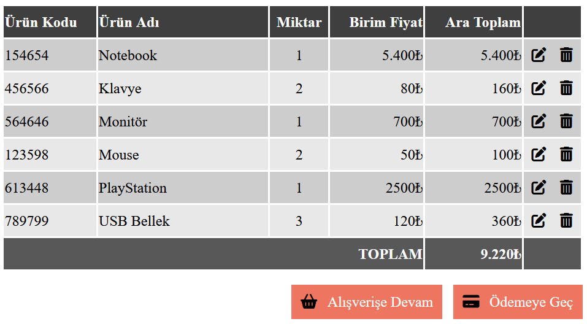

<div align=center>
	<h1>Basic Table - 2</h1>
</div>

<div align="center">
	<a href="https://testerdoe.github.io/html-css-main-repo-test/basic-table2/">
		
	</a>
	<br>
	
</div>

## Description

Basic html table design. 

## Goals

Practicing on;
 
* Html table elements 
* Pseudo classes
* Using fontawesome library
* Using flex(just for aligning).


## Resource Structure 

```
basic-table2(folder)
|
|-- README.md
|-- images
|   |-- basic-table2-presentation.png
|-- index.html
|-- reference
    |-- 2.png
    |-- alsveris_sepeti_2.png
```


## Methodology

* Used

	* HTML elements
	* CSS selectors
	* CSS style attributes
	* Fontawesome library
	* Flex

* Not used

	* External CSS files
	* Box model
	* Grid layout
	* Float, position
	* CSS Media Queries
	* Bootstrap
	* JavaScript
		* and so on...


