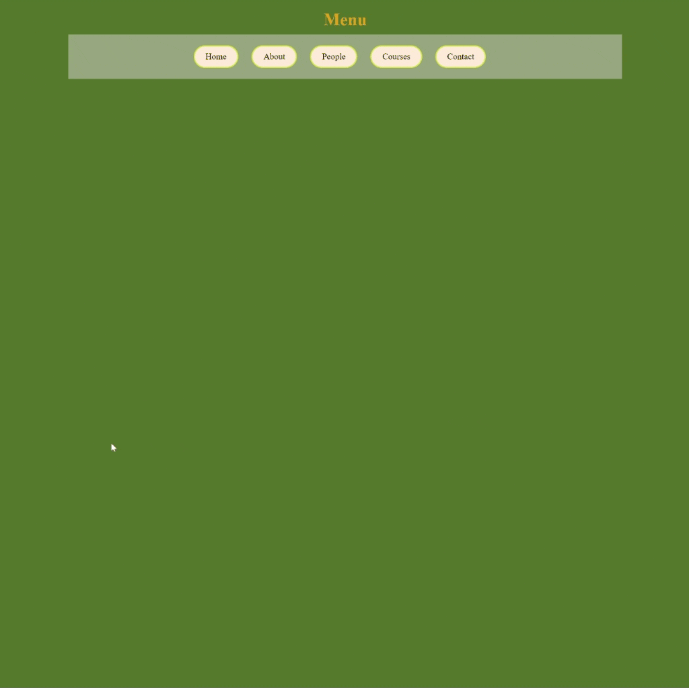

<div align=center>
	<h1>Buttons</h1>
</div>

<div align="center">
	<a href="https://testerdoe.github.io/html-css-main-repo-test/buttons/">
		
	</a>
	<br>
	
</div>

## Description

Basic buttons design. 

## Goals

Practicing on display properties and pseudo classes.


## Resource Structure 

```
buttons(folder)
|
|-- README.md
|-- images
|   |-- buttons-presentation.gif
|-- index.html
|-- reference
    |-- buttonsRef.png
```


## Methodology

* Used

	* HTML elements
	* CSS selectors
	* CSS style attributes

* Not used

	* External CSS files
	* Box model
	* Grid, flex layouts
	* Float, position
	* CSS Media Queries
	* Bootstrap
	* JavaScript
		* and so on...


