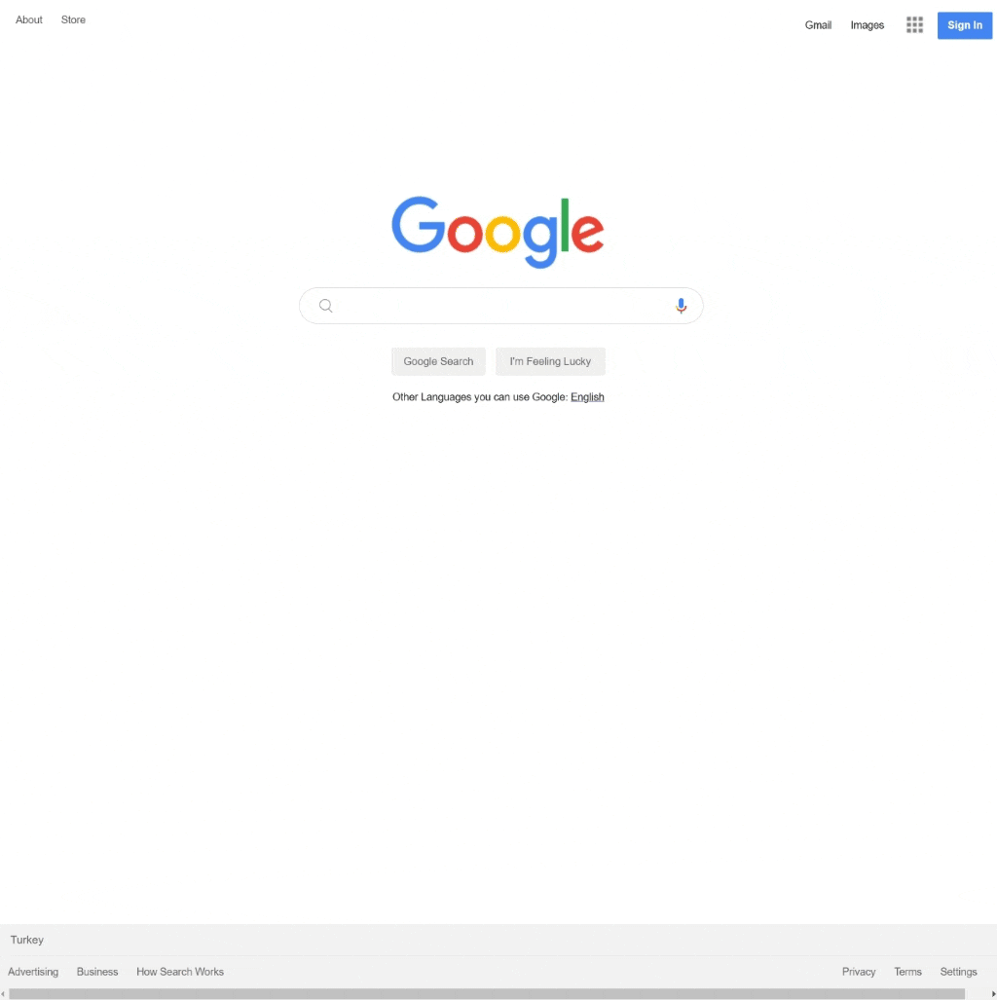

<div align=center>
	<h1>Google Landing Page</h1>
</div>

<div align="center">
	<a href="https://testerdoe.github.io/html-css-main-repo-test/google-clone/">
		
	</a>
	<br>
	
</div>

## Description

Google landing page clone without live links(a[href="#"]). 

## Goals

Practicing on; 

* Pseudo classes
* Using floats to align header & footer items
* Relative positioning 
 

## Resource Structure 

```
google-clone(folder)
|
|-- README.md
|-- images
|   |-- Magnifying_glass_icon.png
|   |-- README.md
|   |-- appicon.png
|   |-- gfavicon.png
|   |-- google-landing-page-presentation.gif
|   |-- google_microphone.png
|   |-- googlelogo.png
|   |-- i1_1967ca6a.png
|   |-- icon-menu.jpg
|   |-- magnifying_glass.jpg
|-- index.html
|-- style
    |-- style.css
```


## Methodology

* Used

	* HTML elements
	* CSS selectors
	* CSS style attributes
	* Box model
	* Float 
	* Position
	* External CSS files


* Not used

	* Grid, flex layouts
	* CSS Media Queries
	* Bootstrap
	* JavaScript
		* and so on...


