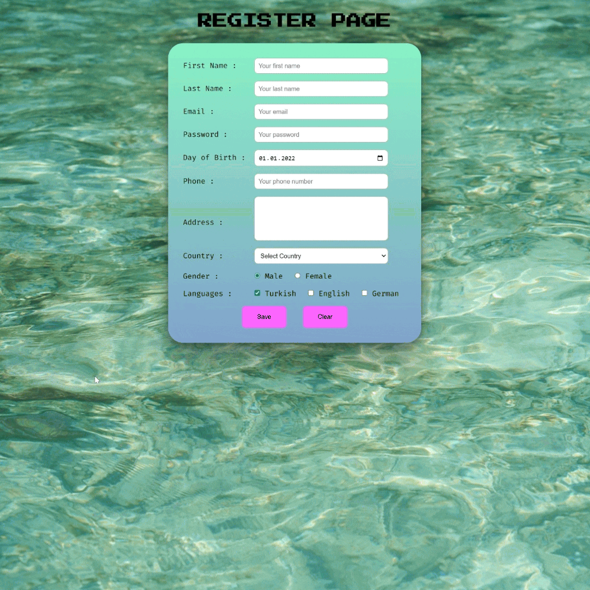

<div align=center>
	<h1>Register Form</h1>
</div>

<div align="center">
	<a href="https://testerdoe.github.io/html-css-main-repo-test/register-form/">
		
	</a>
	<br>
	
</div>

## Description

Basic register page design. 

## Goals

Practicing on; 

* Pseudo classes
* Display properties for inline elements sizing 
 

## Resource Structure 

```
login-page(folder)
|
|-- README.md
|-- countrySelect.html
|-- images
|   |-- bamboo-1280.jpg
|   |-- clouds-1920.png
|   |-- hd-wallpaper-1280.jpg
|   |-- hd-wallpaper2-1280.jpg
|   |-- ink-1280.jpg
|   |-- leaves-1280.jpg
|   |-- register-form-presentation.gif
|   |-- water-1280.jpg
|-- index.html
|-- reference
|   |-- assignment.png
|   |-- registerPage.png
|-- styles
    |-- registerForm.css
```


## Methodology

* Used

	* HTML elements
	* CSS selectors
	* CSS style attributes
	* Box model
	* Display properties
	* External CSS files


* Not used

	* Grid, flex layouts
	* Float, poisiton
	* CSS Media Queries
	* Bootstrap
	* JavaScript
		* and so on...


