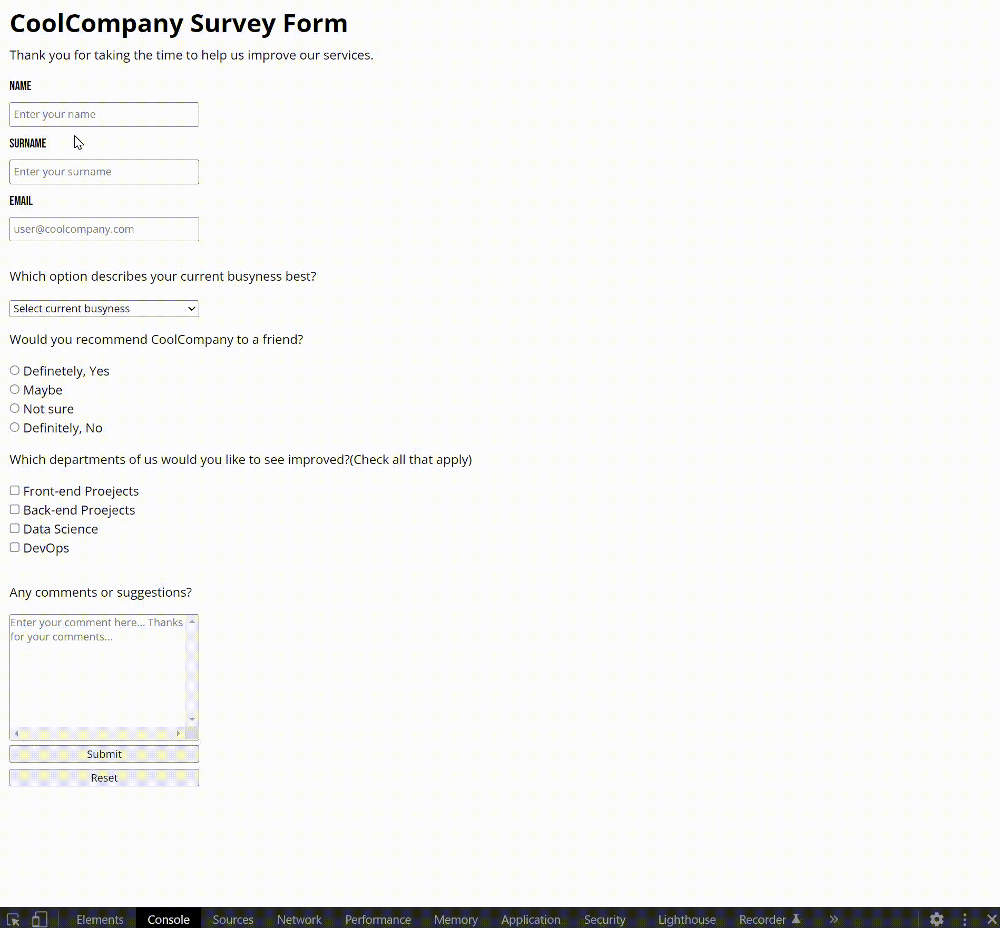

<div align=center>
	<h1>Survey Form</h1>
</div>

<div align="center">
	<a href="https://testerdoe.github.io/html-css-main-repo-test/survey-form/">
		
	</a>
	<br>
	
</div>


## Description

Simple main HTML survey form with another linked HTML collecting input values and printing them


Practicing on; 

* HTML form elements
* Pseudo classes
* Checking form values(via prebuilt html) at backend

## Resource Structure 

```
survey-form(folder)
|
|-- README.md
|-- images
|   	|-- survey-form-presentation.gif
|-- index.html
|-- results.html
|-- style.css
```

## Methodology

* Used

	* HTML elements
	* Focused on fieldset and form elements
	* External HTML to store input values


* Not used

	* Grid
	* External CSS Stylization
	* Internal CSS Stylization
	* CSS Media Queries
	* JavaScript
	* Bootstrap
		* and so on...
